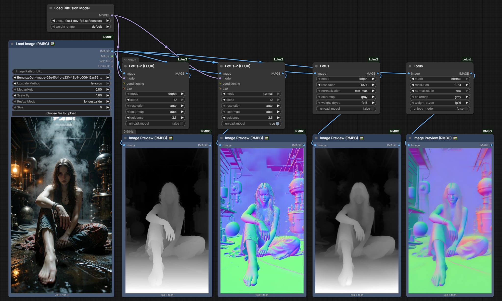

# ComfyUI-Lotus-2

An elegant, high-performance ComfyUI dual-engine node suite for **Lotus** and **Lotus-2** (Generative SOTA Monocular **Disparity Depth** and **Surface Normal** estimation).


Unified under Category: **`🧪AILab/Geometry`**.

---

## 💡 Design Philosophy: Subtracting Clutter, Adding Intelligence

Traditional research implementations of Lotus-2 require dragging 5~7 nodes onto your canvas (Base Model Loader + Model LoRA Patcher + DualCLIPLoader + CLIPTextEncode("") + VAELoader + Sampler + Colorizer).

**ComfyUI-Lotus-2 radically re-engineers this experience:**
- **2 Wires Plug-and-Play**: You only connect **`image`** and **`model`**. That's it!
- **Zero CLIP Clutter (Precomputed Empty Prompt)**: Built-in 2MB authentic FLUX empty-prompt vector (`flux_empty_embed.pt`). No need to drag a 10GB T5 CLIP loader just to feed an empty string!
- **Automatic VAE Resolution**: Detects and caches your local `ae.safetensors` in VRAM. Zero redundant VAE nodes required.
- **Smart `colormap: auto`**: Automatically outputs standard 3D Normal vectors when in `normal` mode, and ControlNet-ready grayscale depth when in `depth` mode.
- **Single `IMAGE` Output**: No confusing duplicate RAW pins. One pin feeds directly into ControlNet, Preview, or Save nodes.

---

## 📊 Dual-Engine Comparison: Choose the Right Tool

| Feature | `Lotus` (SD2.1 Fast Engine) | `Lotus-2 (FLUX)` (SOTA Detail Engine) |
| :--- | :--- | :--- |
| **Node Name** | `Lotus` | `Lotus-2 (FLUX)` |
| **Category** | `🧪AILab/Geometry` | `🧪AILab/Geometry` |
| **Base Architecture** | Stable Diffusion 2.1 (UNet) | FLUX.1-dev (12B DiT) |
| **Model Size** | ~1.7 GB (self-contained) | Reuses existing FLUX model + 1.43GB LoRA |
| **Typical Speed** | **~1.5 seconds** | **~13 seconds** (1-step on GGUF / FP8) |
| **VRAM Footprint** | ~4 GB – 8 GB | Fits 8GB – 16GB with GGUF / FP8 |
| **Best For** | Real-time preview, video batches, ControlNet | Hairline micro-details, complex occlusion, PBR |
| **Inputs Required** | `image` | `image`, `model` |

---

## 🎯 Steps Guide: How Many Steps Should You Use?

Lotus-2 is a two-stage deterministic pipeline (Stage 1: Core Predictor + LCM; Stage 2: Detail Sharpener).

### 1. `mode: depth` (Disparity Depth Estimation)
- **Recommended: `steps = 1` (Instant Mode, ~13s on GGUF)**
- Stage 1 Core Predictor mathematically distills global physical disparity in a single forward pass.
- 99% of depth workflows (ControlNet Depth, 3D parallax, background defocus) achieve full production quality at `steps = 1`. Running more steps provides negligible depth gain.

### 2. `mode: normal` (Surface Normal Vector Estimation)
- **Smooth surfaces, vehicles, architecture, skin, furniture**:
  - **Recommended: `steps = 1`**. Surfaces are smooth, clean, and instant.
- **Curly hair, fur, micro-textures, delicate lace**:
  - **Recommended: `steps = 2 ~ 4`**.
  - **Why?** FLUX processes latents in $2 \times 2$ pixel patches. On ultra-high-frequency textures like wavy red hair, single-step inference can show faint patch grid lines. Setting `steps: 2 ~ 4` activates the Stage 2 **Detail Sharpener**, which specifically smooths away patch grid boundaries and sharpens individual hair strands!

---

## 🎨 `colormap` Guide: What Does `auto` Do?

| `colormap` Setting | In `mode: depth` | In `mode: normal` |
| :--- | :--- | :--- |
| **`auto` (Default)** | **ControlNet-Ready Grayscale** (Normalized 0~1: White = Near, Black = Far). | **Standard 3D Surface Normal Map** (RGB = XYZ direction vectors). |
| **`gray`** | Grayscale depth map. | Normal map. |
| **`spectral`** | Thermal rainbow heatmap (Red = Near, Yellow = Mid, Blue = Far). | Normal map. |
| **`turbo`** | High-contrast rainbow heatmap. | Normal map. |

---

## 📦 Installation

Clone into your ComfyUI `custom_nodes` directory:

```bash
cd ComfyUI/custom_nodes
git clone https://github.com/1038lab/ComfyUI-Lotus2.git
```

> **Clean Dependencies**: Only standard PyTorch and ComfyUI built-in dependencies are required. Zero external bloat.

---

## 🚀 Quick Start Workflows

### Minimal 2-Wire Setup:
1. Add `Load Diffusion Model` (or `Unet Loader (GGUF)`). Select `flux1-dev-fp8.safetensors` or GGUF (e.g. `Q4_K` / `Q5_K`).
2. Add `Lotus-2 (FLUX)`.
3. Connect:
   - `model` ➔ `Lotus-2 (FLUX)`
   - `image` ➔ `Lotus-2 (FLUX)`
4. Connect `IMAGE` output to `Preview Image` or `Apply ControlNet`.

*(Optional sockets for `conditioning` and `vae` are available if you wish to override defaults with custom inputs).*

---

## 📁 Model Storage Directory

All weights are downloaded into standard ComfyUI directories (never polluting C: drive):

```
ComfyUI/models/geometry_estimation/
├── lotus-depth-g-v2-1-disparity-fp16.safetensors  (1.73 GB - Lotus 1 Depth)
├── lotus-normal-g-v1-1-fp16.safetensors          (1.73 GB - Lotus 1 Normal)
├── lotus-2_core_predictor_depth.safetensors      (1.43 GB - Lotus 2 Core Depth)
├── lotus-2_core_predictor_normal.safetensors     (1.43 GB - Lotus 2 Core Normal)
├── lotus-2_detail_sharpener_depth.safetensors    (1.43 GB - Lotus 2 Sharpener Depth)
├── lotus-2_detail_sharpener_normal.safetensors   (1.43 GB - Lotus 2 Sharpener Normal)
└── lotus-2_lcm_depth.safetensors                 (39 KB   - Lotus 2 LCM)
```

---

## 📜 Acknowledgements

- [Lotus-2 Research (EnVision-Research / 1038lab)](https://github.com/EnVision-Research/Lotus-2): Original Lotus & Lotus-2 research papers and weights.
- [Black Forest Labs](https://blackforestlabs.ai/): FLUX.1 base architecture.
- [ComfyUI](https://github.com/comfyanonymous/ComfyUI): Modular generative AI framework.
